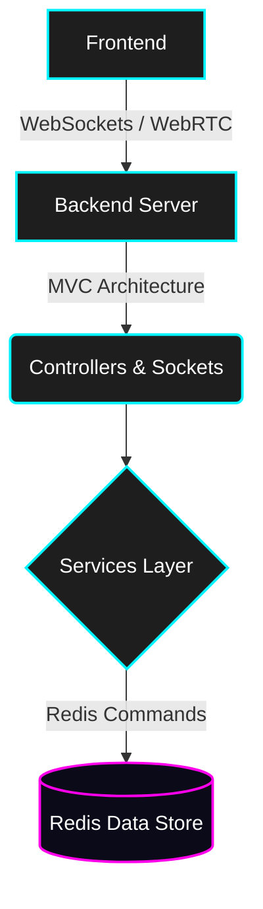

  
  
  # 💬 AuraMeet: Ephemeral Video & Chat

  *A sleek, modern, scalable, and fully ephemeral real-time communication platform built with Node.js, WebRTC, Redis, and pure magic.*
  
  
  
  
  
  

---

## 📑 Table of Contents
- [📖 Introduction](#-introduction)
- [✨ Key Features](#-key-features)
- [💼 Professional & Enterprise Use Cases](#-professional--enterprise-use-cases)
- [📚 Documentation Index](#-documentation-index)
- [📲 Install as a Mobile App (PWA)](#-install-as-a-mobile-app-pwa)
- [🛠️ Quick Tech Stack Overview](#️-quick-tech-stack-overview)
- [🔒 Security & Privacy Guarantee](#-security--privacy-guarantee)

---

## 📖 Introduction

**AuraMeet** (meaning "Conversation" in Hindi) is a cutting-edge, real-time video and text chat application designed from the ground up for absolute privacy and zero persistence. When you join a room, you communicate directly via peer-to-peer WebRTC streams. When the last person leaves the room, the room and all its data are wiped from existence instantly.

No SQL databases. No chat history. No logs. Just pure, real-time, ephemeral communication built on a robust MVC backend.

---

## ✨ Key Features

- **🎥 Peer-to-Peer Video Calls:** High-quality, low-latency video streaming powered by native WebRTC and TURN fallback integration.
- **💬 Real-Time Messaging:** WhatsApp-styled text chat interface with dynamic typing indicators.
- **🖼️ View-Once Ephemeral Images:** Send images directly in the chat that are automatically compressed and transmitted purely over WebSockets. Once viewed and closed, the image data is instantly and permanently destroyed.
- **👻 Fully Ephemeral Design:** Data only exists while people are present. Managed entirely by Redis TTLs and hash counts.
- **📱 Progressive Web App (PWA):** Fully installable mobile app experience. Works offline, launches in full-screen standalone mode without a browser bar.
- **🎨 Multiplayer Air Draw:** A dynamic, synchronized canvas overlay that allows users to draw directly on the video feed in real-time. Hand-tracked strokes are smoothly rendered and instantly broadcasted.
- **🎉 Animated Reactions & Emoji Gallery:** A comprehensive, dark-mode glassmorphic emoji picker with floating animations.
- **🚀 Production-Ready Architecture:** Clean MVC folder structure, strict rate-limiting, Helmet security headers, graceful shutdown handling, and a full CI/CD testing pipeline using Jest and GitHub Actions.

---

## 💼 Professional & Enterprise Use Cases

AuraMeet is engineered for high-stakes, confidential communications where privacy is non-negotiable. 

- **⚖️ Legal Consultations:** Maintain absolute attorney-client privilege. Without database records or logs, communications cannot be subpoenaed.
- **🏥 Telemedicine & Healthcare:** Conduct secure, non-persistent health consultations. Patient data is transmitted securely and never stored.
- **🏢 Executive Briefings:** Prevent corporate espionage and data leaks during sensitive strategic discussions.

---

## 📚 Documentation Index

To keep this README clean, detailed technical documentation has been divided into specialized modules packed with architectural flowcharts and diagrams:

### 1. [🏗️ Architecture & Logic](docs/architecture.md)
Discover the backend mechanics, including:
- **MVC Structure Flowcharts:** How the router, controllers, and services interact.
- **WebRTC Signaling Flow:** How Offers, Answers, and ICE candidates are routed via Socket.IO.
- **Redis State Management:** The logic behind the ephemeral "No Database" design.

### 2. [🎮 UI & Controls Logic](docs/ui-controls.md)
Dive into the frontend magic, including:
- **Mobile Miniplayer:** The drag-and-drop mathematics and CSS translation behind the floating PIP.
- **Chat & Reactions:** The logic driving typing indicators and floating CSS animations.

### 3. [🚀 Deployment & Setup Guide](docs/deployment.md)
Learn how to run AuraMeet, including:
- **CI/CD Pipeline Flowchart:** How GitHub Actions tests and deploys the app.
- **Local Setup & Testing:** Running Jest integration tests and Redis locally.
- **Reverse Proxy:** Nginx configuration for secure WebRTC.

---

## 📲 Install as a Mobile App (PWA)

AuraMeet is a fully configured Progressive Web App (PWA). You can install it directly to your device for a native-like experience:

- **Android (Chrome):** Open the site, tap the menu (⋮), and select **"Install App"**.
- **iOS (Safari):** Open the site in Safari, tap the **Share** button, and select **"Add to Home Screen"**.
- **Desktop (Chrome/Edge):** Click the **Install** icon on the right side of the URL address bar.

---

## 🛠️ Quick Tech Stack Overview

- **Backend:** Node.js, Express, Socket.IO
- **Data Layer:** Redis (In-Memory Key-Value Store)
- **Frontend:** Vanilla JavaScript, HTML5, Vanilla CSS, EJS
- **Signaling Protocol:** WebSockets (Socket.IO)
- **CI/CD & Testing:** GitHub Actions, Jest, Supertest, Husky, Lint-Staged

---

## 🔒 Security & Privacy Guarantee
This application does **not** use a permanent database. All room states and active connections are held entirely in Redis. Once the last person disconnects, the server executes a self-destruct sequence, ensuring the room automatically wipes itself from memory. 

---

  
Built with ❤️ using Node.js and WebRTC.

