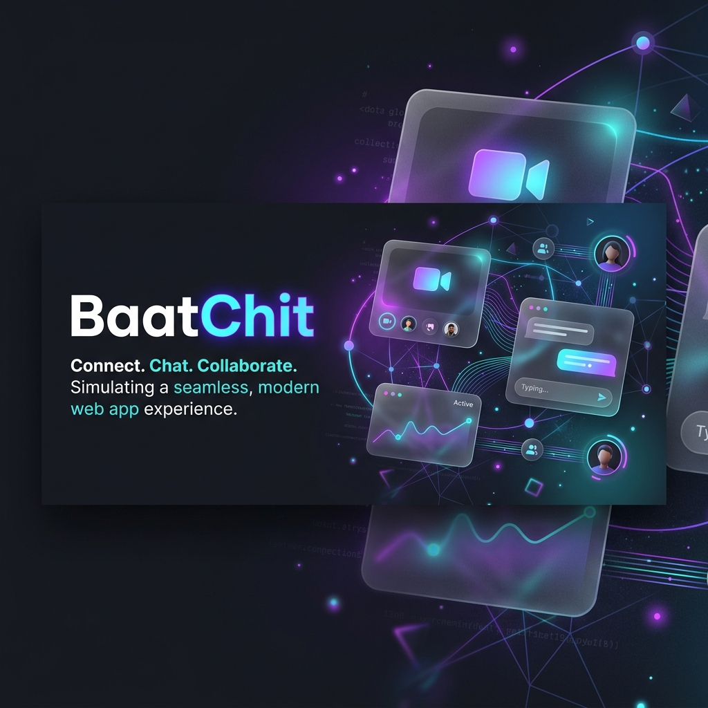

<div align="center">
  
  
  # 💬 BaatChit: Ephemeral Video & Text Chat

  *A sleek, modern, fully ephemeral real-time communication platform built with Flask, WebRTC, and pure magic.*
</div>

---

## ✨ Features

- **🎥 Peer-to-Peer Video Calls:** High-quality, low-latency video streaming powered by native WebRTC and Google STUN servers.
- **💬 Real-Time Messaging:** WhatsApp-styled text chat interface with dynamic typing indicators.
- **👻 Fully Ephemeral:** No databases, no logs, no chat history. Once everyone leaves a room, the data is gone forever.
- **📱 Fully Responsive Design:** Stunning glassmorphism UI with a dynamic mobile layout featuring a YouTube-style floating Picture-in-Picture (PIP) miniplayer.
- **🎉 Animated Reactions:** Instantly send fully animated emoji reactions (👍, ❤️, 😂, 🎉, 😘) that float seamlessly across the entire screen!
- **🎧 Advanced Audio Filtering:** Built-in echo cancellation, automatic gain control, and noise suppression for crystal clear audio.

## 🚀 Quick Start

### Prerequisites
- Python 3.8+
- A modern web browser with WebRTC support (Chrome, Firefox, Safari)

### Installation

1. **Clone the repository:**
   ```bash
   git clone https://github.com/yourusername/baatchit.git
   cd baatchit
   ```

2. **Install dependencies:**
   *(Ensure you have Flask, Flask-SocketIO, and Eventlet installed)*
   ```bash
   pip install flask flask-socketio eventlet
   ```

3. **Run the server:**
   ```bash
   python app.py
   ```
   *Note: For camera and microphone access to work over the internet on non-localhost devices, you must serve the application over **HTTPS** or use an SSH tunnel like `ngrok`.*

4. **Access the application:**
   Open your browser and navigate to `http://localhost:5000`

## 🛠️ Tech Stack

- **Backend:** Python, Flask, Flask-SocketIO, Eventlet
- **Frontend:** Vanilla JavaScript, HTML5, Vanilla CSS
- **Signaling:** WebSockets (Socket.IO)
- **Media Streaming:** WebRTC API

## 📱 Mobile Experience
BaatChit is designed to feel like a native application on mobile devices.
- **Floating Miniplayer:** The video feed collapses into a picture-in-picture window while chatting.
- **Smart Controls:** Controls intuitively adapt and wrap perfectly based on your screen size.

## 🔒 Security & Privacy
This application does **not** use a database. All room states and active connections are held entirely in memory. Once the last person disconnects, the room automatically terminates and wipes itself from existence.

---
<div align="center">
  <p>Built with ❤️ using Flask and WebRTC.</p>
</div>
