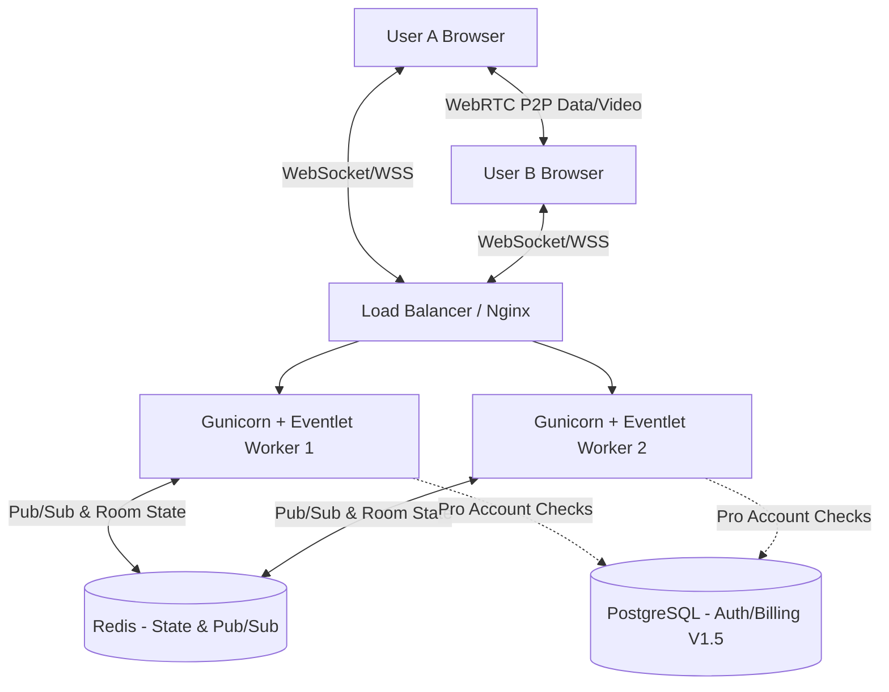

# System Architecture Document (SAD) - BaatCheet

## 1. System Overview
BaatCheet's architecture is built around the concept of ephemeral communication. It utilizes a central WebSocket server for signaling and chat, backed by Redis for fast, volatile state management. Screen sharing is offloaded to peer-to-peer WebRTC connections to minimize server bandwidth and ensure privacy.

## 2. High-Level Architecture Diagram

## 3. Data Flow & State Management
- **Room Creation:** A POST request generates a secure, random room code. The code is stored in Redis with a TTL of 3600 seconds.
- **WebSocket Signaling:** When users join a room, Flask-SocketIO handles the bidirectional communication. Redis acts as the message broker, allowing users connected to different Gunicorn workers to chat seamlessly.
- **WebRTC Flow:**
  1. User A initiates screen share.
  2. User A sends a WebRTC Offer via Socket.io to User B.
  3. User B replies with a WebRTC Answer via Socket.io.
  4. Both clients exchange ICE candidates via Socket.io.
  5. A direct WebRTC peer-to-peer connection is established; video data bypasses the Flask server entirely.
- **The "Purge" (Session End):** When the `leave` event fires and the Redis room user count hits zero, the Flask server immediately deletes the room key and all associated message state from Redis.

## 4. Deployment Architecture
- **Hosting Platform:** Suitable for PaaS providers like Render or Heroku that support WebSocket connections.
- **Caching Layer:** Redis must be deployed alongside the application for the ephemeral state.
- **Concurrency:** Gunicorn must be run with the `eventlet` worker class (e.g., `gunicorn -k eventlet -w 1 app:app`) to handle thousands of concurrent WebSocket connections efficiently.

## 5. Security Architecture
- **Zero-Footprint Policy:** No chat data is written to a persistent disk. All data resides in Redis and is actively purged.
- **WebRTC Security:** WebRTC mandates DTLS (Datagram Transport Layer Security) and SRTP (Secure Real-Time Transport Protocol), ensuring end-to-end encryption for screen sharing.
