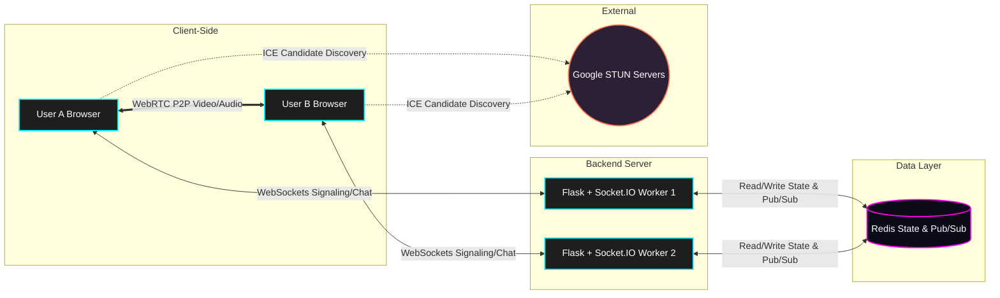

# 🏗️ BaatCheet Architecture

BaatCheet is built on a modern, fully ephemeral, and scalable architecture designed to handle real-time video, audio, and text communication with zero persistent storage.

## High-Level Overview

The architecture consists of three primary layers:
1.  **Client-Side (Frontend):** Pure Vanilla JavaScript, HTML5, and CSS3 handling WebRTC peer-to-peer media streams and Socket.IO for signaling/chat.
2.  **Application Server (Backend):** A Python Flask application powered by `Flask-SocketIO` and `eventlet` for asynchronous WebSocket communication.
3.  **State Management (Data Layer):** Redis acts as both an in-memory key-value store for room/user state and a message queue for scaling across multiple worker processes.



---

## 🔗 WebRTC & Signaling Flow

BaatCheet uses WebRTC for peer-to-peer video and audio streaming, meaning media does *not* route through the server, ensuring extremely low latency and high privacy. The server's only job in the media pipeline is **signaling** (exchanging connection data).

### The Signaling Process
1.  **Join Event:** A client joins a room via Socket.IO (`socket.emit('join')`).
2.  **Offer Creation:** Existing users in the room receive a `user_joined` event. They create an `RTCPeerConnection`, generate a WebRTC Offer (SDP), and send it to the new user via the server (`webrtc_offer`).
3.  **Answer Creation:** The new user receives the offer, sets it as their remote description, generates an Answer (SDP), and sends it back (`webrtc_answer`).
4.  **ICE Candidates:** Throughout this process, clients discover their public IP addresses using Google's public STUN servers (`stun.l.google.com:19302`). These network paths (ICE candidates) are exchanged via the server (`webrtc_ice_candidate`).
5.  **P2P Connection Established:** Once SDPs and ICE candidates are exchanged, a direct peer-to-peer connection is established. Video and audio tracks are attached to dynamic `<video>` elements in the DOM.

### Mobile Device Capabilities
- **Camera/Microphone:** Fully supported on all modern mobile browsers (iOS Safari, Android Chrome) via `getUserMedia` (requires HTTPS).
- **Screen Sharing:** Mobile operating systems inherently block web applications from capturing the screen for security reasons (`getDisplayMedia` is unsupported). Mobile users can seamlessly *view* screens shared by desktop users, but cannot broadcast their own screens. The UI elegantly intercepts this limitation and provides an educational modal.

---

## 🧠 Redis State Management (The Ephemeral Design)

BaatCheet strictly adheres to a "No Database" policy for absolute privacy. All state is stored in Redis and is highly volatile.

### Redis Key Schema
-   `room:{room_code}:exists` (String): A temporary marker set when a room is created. It has a TTL of 3600 seconds (1 hour). If no one joins, the room expires automatically.
-   `room:{room_code}:name` (String): An optional custom name assigned to the room by the creator. Uses the exact same 3600s TTL as the existence key.
-   `room:{room_code}:users` (Hash): Stores active users in a room. Key = Socket ID (`request.sid`), Value = Username.
-   `sid:{sid}:room` (String): Maps a user's Socket ID to their current room code (O(1) lookup on disconnect).
-   `sid:{sid}:username` (String): Maps a user's Socket ID to their username.

### Zero-Log Metrics & Transparency
To build trust and prove the "Zero-Log" guarantee, the backend actively exposes its own memory state. The `/api/stats` endpoint queries Redis for `dbsize`, active room counts (by scanning `room:*:exists`), and the absence of log files, returning real-time data to the landing page dashboard.

### Ephemeral Cleanup Logic
When a user disconnects or clicks "Leave Room", the server intercepts the `disconnect` event:
1.  Removes the user from the `room:{room_code}:users` hash.
2.  Deletes their `sid:*` keys.
3.  **The Self-Destruct Sequence:** If the `room:{room_code}:users` hash becomes empty (length == 0), the server immediately deletes the `room:{room_code}:exists` and `room:{room_code}:users` keys. The room is wiped from existence instantly.

---

## 🚀 Scaling & Concurrency

By default, WebSockets bind users to a specific server process. If you run multiple Gunicorn workers, a user on Worker A cannot communicate with a user on Worker B.

**The Solution: Redis Message Queue**
BaatCheet initializes `SocketIO` with a `message_queue` parameter pointing to Redis:
```python
socketio = SocketIO(app, async_mode='eventlet', message_queue=REDIS_URL)
```
This configures a pub/sub mechanism. When Worker A emits a message to a room, it publishes the event to Redis. All other workers subscribe to this event and forward the message to any connected clients in that room. This allows BaatCheet to scale horizontally across multiple servers or containers with ease.
