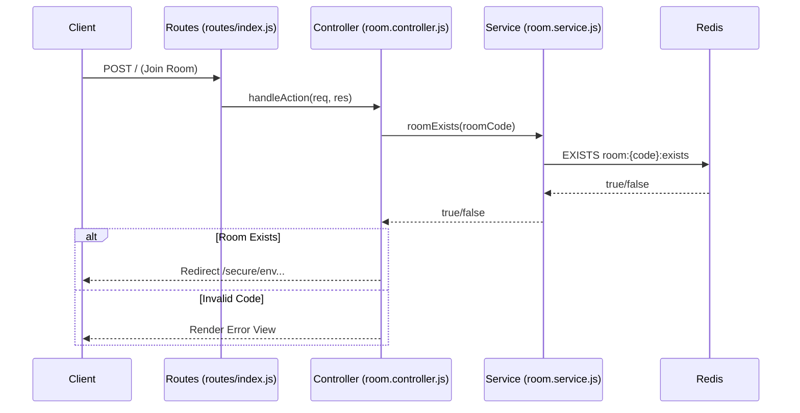
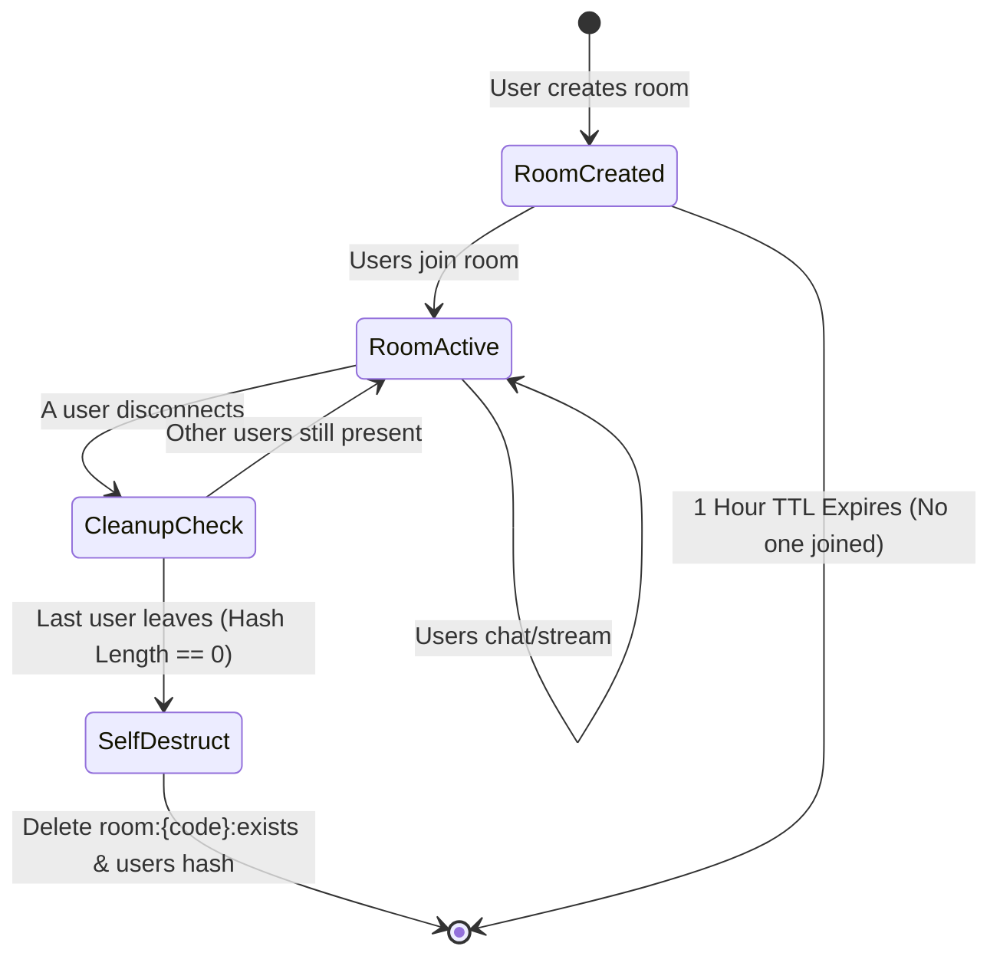

# 🏗️ AuraMeet Architecture

AuraMeet is built on a modern, fully ephemeral, and scalable architecture designed to handle real-time video, audio, and text communication with zero persistent storage. The backend strictly follows a modular **MVC (Model-View-Controller)** pattern.

## High-Level System Architecture

The architecture consists of three primary layers:
1.  **Client-Side (Frontend):** Pure Vanilla JavaScript, HTML5, and CSS3 handling WebRTC peer-to-peer media streams and Socket.IO for signaling/chat.
2.  **Application Server (Backend):** A Node.js Express application utilizing a Service-Controller pattern and `Socket.IO` for asynchronous WebSocket communication.
3.  **State Management (Data Layer):** Redis acts as both an in-memory key-value store for room/user state and a message queue for scaling across multiple worker processes.

---

## 📂 MVC Directory Structure & Data Flow

To ensure the codebase is maintainable and testable, the backend logic is cleanly separated.

### Codebase Organization
- `server.js`: The bootstrap file. Sets up security middlewares (Helmet, CORS, Rate Limit), initializes Express and Socket.IO, and binds the router.
- `src/routes/index.js`: Maps HTTP endpoints (e.g., `/join`, `/`) to specific controller functions.
- `src/controllers/room.controller.js`: Handles incoming HTTP requests, extracts parameters, and sends responses (or renders EJS views).
- `src/sockets/index.js`: Dedicated file for all WebSocket event listeners (`join`, `send_message`, `webrtc_offer`).
- **`src/services/room.service.js`**: The Data Access Layer. Contains all the business logic and direct Redis queries. Neither controllers nor sockets interact with Redis directly; they always go through the service layer.

### HTTP Request Flowchart

---

## 🔗 WebRTC & Signaling Flow

AuraMeet uses WebRTC for peer-to-peer video and audio streaming, meaning media does *not* route through the server, ensuring extremely low latency and high privacy. The server's only job in the media pipeline is **signaling** (exchanging connection data).

### The Signaling Process
1.  **Join Event:** A client joins a room via Socket.IO (`socket.emit('join')`).
2.  **Offer Creation:** Existing users in the room receive a `user_joined` event. They create an `RTCPeerConnection`, generate a WebRTC Offer (SDP), and send it to the new user via the server (`webrtc_offer`).
3.  **Answer Creation:** The new user receives the offer, sets it as their remote description, generates an Answer (SDP), and sends it back (`webrtc_answer`).
4.  **ICE Candidates:** Throughout this process, clients discover their public IP addresses using Google's public STUN servers. These network paths are exchanged via the server.
5.  **P2P Connection Established:** Once SDPs and ICE candidates are exchanged, a direct peer-to-peer connection is established.

---

## 🧠 The Ephemeral Lifecycle (Redis State Management)

AuraMeet strictly adheres to a "No Database" policy for absolute privacy. All state is stored in Redis and is highly volatile. 

### Redis Key Schema
-   `room:{room_code}:exists` (String): A temporary marker set when a room is created. It has a TTL of 3600 seconds (1 hour). If no one joins, the room expires automatically.
-   `room:{room_code}:users` (Hash): Stores active users in a room. Key = Socket ID, Value = Username.
-   `sid:{sid}:room` (String): Maps a user's Socket ID to their current room code (O(1) lookup on disconnect).

### The Self-Destruct Sequence
When a user disconnects, the `roomService.removeUserFromRoom(sid)` function executes. If the room's user hash becomes empty, the room is instantly purged from memory.

---

## 🚀 Scaling & Concurrency (Redis Adapter)

By default, WebSockets bind users to a specific server process. If you run multiple Node.js instances, a user on Instance A cannot communicate with a user on Instance B.

**The Solution: Redis Adapter**
AuraMeet initializes `Socket.IO` with the `@socket.io/redis-adapter`. This configures a pub/sub mechanism. When Instance A emits a message to a room, it publishes the event to Redis. All other instances subscribe to this event and forward the message to any connected clients in that room. This allows AuraMeet to scale horizontally across multiple servers or containers with ease.
