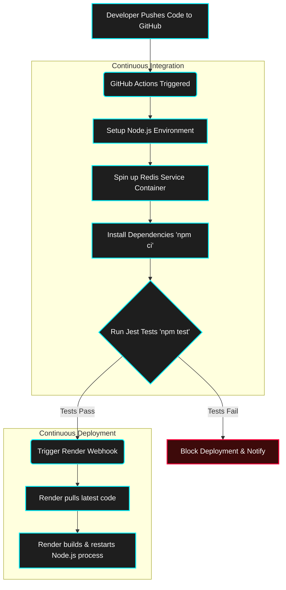

# 🚀 Deployment & CI/CD Pipeline

This guide details how the AuraMeet application is tested, configured, and deployed for both local development and production environments.

## 🔄 CI/CD Pipeline Flow

AuraMeet utilizes a robust CI/CD (Continuous Integration / Continuous Deployment) pipeline via GitHub Actions to ensure code quality and prevent regressions in production.



1. **Pre-commit Hooks:** Before code even reaches GitHub, Husky and `lint-staged` run locally on the developer's machine to format code (Prettier) and run tests.
2. **Integration Testing:** GitHub Actions spins up an ephemeral Redis container alongside Node.js to execute Supertest integration tests against the API routes.
3. **Gated Deployment:** The deployment to the production server (Render) is explicitly gated. The Render webhook is only fired if the `test` job succeeds.

---

## 🛠 Prerequisites for Local Setup

Before starting, ensure you have the following installed on your system:
-   **Node.js 18+**: The backend framework is built on Node.js.
-   **Redis Server**: Required for state management and Socket.IO message queuing/scaling.
-   **Modern Web Browser**: Chrome, Firefox, Safari, or Edge (must support WebRTC).

## 💻 Local Development Setup

1.  **Clone the Repository:**
    ```bash
    git clone https://github.com/ArnavPundir22/AuraMeet.git
    cd AuraMeet
    ```

2.  **Install Dependencies:**
    ```bash
    npm install
    ```

3.  **Start Redis Server:**
    Make sure your local Redis server is running on the default port `6379`.
    ```bash
    redis-server
    ```

4.  **Run the Node.js Development Server:**
    ```bash
    npm start
    ```
    Access the app at `http://localhost:5000`.

5.  **Running Tests Locally:**
    To run the Jest test suite, simply execute:
    ```bash
    npm test
    ```
    *(Note: Redis must be running locally for tests to pass).*

---

## 🌐 Production Deployment (Render / Heroku / Custom VPS)

For production, AuraMeet is designed to deploy seamlessly on modern platforms like Render. The application features **Graceful Shutdown** listeners (`SIGTERM`/`SIGINT`), meaning when the PaaS restarts the server, it will cleanly close HTTP and Redis connections without crashing active sessions abruptly.

### Environment Variables

You can customize the application behavior using the following environment variables (defined securely in `.env` locally, or in your host's dashboard):
-   `PORT`: The port on which the server binds (Default: `5000`).
-   `REDIS_URL`: Connection string for your Redis instance (Default: `redis://localhost:6379`).
-   `CORS_ORIGIN`: Define specific domains allowed to make cross-origin requests (Default: `*`).
-   `TURN_URL`: The URL of your TURN server for reliable WebRTC video routing.
-   `TURN_USERNAME`: Username for your TURN server.
-   `TURN_CREDENTIAL`: Password/Credential for your TURN server.

---

## 🔒 A Note on HTTPS, TURN, and WebRTC

WebRTC requires a secure context to access the user's camera and microphone.
-   **Localhost:** Browsers allow media access over `http://localhost`.
-   **Network/Internet:** If you access the application over a network IP or deploy it to a live domain without SSL, the browser will **block** camera and microphone access.
-   **Solution (HTTPS):** You MUST deploy the application behind an HTTPS proxy, or use a cloud provider like Render that automatically provisions SSL certificates.
-   **Solution (TURN):** To ensure 100% connectivity for users on strict corporate, university, or 5G networks (Symmetric NAT), you must configure a TURN server via the environment variables listed above.

## 🛡️ Reverse Proxy Setup (Nginx)

When deploying to a custom VPS, use Nginx as a reverse proxy to handle SSL termination and forward WebSocket traffic to your Node.js application.

```nginx
server {
    server_name yourdomain.com;
    
    location / {
        proxy_pass http://localhost:5000;
        proxy_http_version 1.1;
        proxy_set_header Upgrade $http_upgrade;
        proxy_set_header Connection "upgrade";
        proxy_set_header Host $host;
        proxy_cache_bypass $http_upgrade;
    }
}
```

## 🚑 Troubleshooting Guide

- **Camera/Microphone access is blocked:** Ensure you are accessing the site via `https://` or `http://localhost`.
- **Videos are not connecting (Black Screen):** This is usually an ICE candidate (NAT traversal) failure. Ensure your TURN server credentials in the environment variables are correct.
- **Socket.IO connection drops frequently:** If using multiple Node.js instances behind a load balancer, ensure you have enabled "Sticky Sessions" (Session Affinity) on your load balancer, or that the Redis Adapter is configured and functioning correctly.
